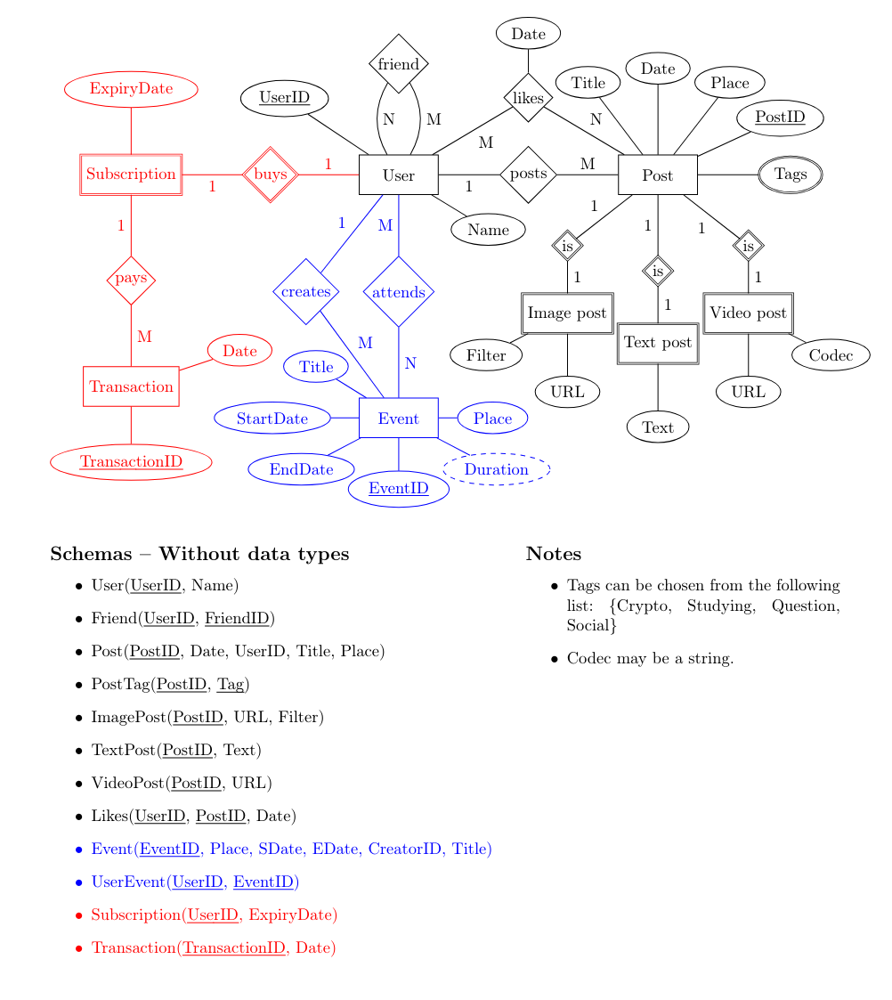

Author:  Toto Roomi

Version: 0.0

# QuickPop
What is QuickPop? 
The name is based on quickcheck + populate = quickpop! It's a DSL that utilizes the quickcheck library to generate random data for a PSQL database of your design. 
The currently supported types of random data are: Addresses, names, event titles, dates, grammatically coherrent sentances, hashtags, urls. Easily extensible with more types of data! 
Features: self-referential and non-reflexive data generation, ID pairs and Date pairs. 


## Dependencies

### Ubuntu
```
sudo apt install stack 
```

## To use 

```
stack run > <filename>.psql
```

### Try out some functions 

``` 
stack repl 
```


## The library 


### PSQSLTYPE 
``` haskell
data PSQLTYPE
  = VARCHAR String
  | DATE (Year, Month, Day) 
  | INTEGER Int
  | TIMESTAMP (Year,Month,Day) (Hour,Min,Sec) Int Bool
  deriving (Eq)

type Year = Int
type Month = Int
type Day = Int
type Hour = Int
type Min = Int
type Sec = Int
```
This datatype represents a few datatypes used in PSQL. All are self explanitory except TIMESTAMP. The last Int represents the timezone and the Boolean wether to include it or not. As PSQL has several representations of the TIMESTAMP datatype. 
To convert to and from these the following functions are provided: 

``` haskell
psqlVarchar :: String -> PSQLTYPE
unVarchar :: PSQLTYPE -> String
psqlDate :: (Int,Int,Int) -> PSQLTYPE
unDate :: PSQLTYPE -> (Int,Int,Int)
psqlInteger :: Int -> PSQLTYPE
unInteger :: PSQLTYPE -> Int
psqlTimestamp :: (Int,Int,Int) -> (Int,Int,Int) -> Int -> Bool -> PSQLTYPE
```

### Gen PSQLTYPE 
There are many random data generators, varying from name and email to date and text generators. You can read about them in the haddock documentation, pre-compiled in ```doc/haddock/index.html```. However the vital generators are the following:

``` haskell
primaryKeys :: Int -> Gen [PSQLTYPE]
```
This generator creates unique numbers between 11111 and 99999. The numbers were arbitrarily chosen because five successive numbers look nice. A larger database is not expected to be created using this library so it is more than enough. 

``` haskell
make :: Int -> Gen a -> Gen [a]
unique :: (Eq a) => Int -> Gen a -> Gen [a]
```
The idea behind these was that you should be able to read the code as if it's human language "Make one hundred emails", "unique ten names". They are fairly self documenting and work as expected, however a caveat is that unique is very slow. It functions at a O(n^3) speed because it keeps generating and removing duplicates, thus it was capped at up to 1000 iterations. The databases produced by this library are not expected to be large, and to keep the niceness of primaryKeys with five numbers it was done this way. Another way would be to introduce a freshness generator that simply iterates. Thus generating a list of n unique numbers would only take O(n) time. 

### Populator 
While the generators create the random data, the populator creates insert statements in the PSQL format and combines, molds and forms generated data into more useful shapes. 

``` haskell
data InsertStatement
 = IS { schemaName :: String,
        attributes :: [String],
        values :: [PSQLTYPE]
      }
 | Statements [InsertStatement]
```
The InsertStatement datatype represents a postgresQL insert statement. 
To create insert statements the following functions are provided: 

``` haskell
insertStatement :: String -> [String] -> [PSQLTYPE] -> InsertStatement
insert :: String -> [String] -> [[PSQLTYPE]] -> InsertStatement
```
The first creates a single insert statement, however the latter creates many insert statements to a single table denoted by the first String, the name of the table. This is followed by the attribute names and finally a list of data to insert. 
The list is a list of lists of data. If you are inserting to a table with usernames and socialsecurity numbers you would send the following list to the function ```[[usernames],[socialsecurity nrs]]```. The function takes care of the rest. Null values are not supported so they have to be of the same lengths. 

Additionally the Populator provides combiinators that create pairs of keys in different shapes. Thesee are again documented in the haddock.

### Pretty printing 
A pretty printer is provided to actually print the data in the format that postgres accepts, along with several debuging printers.

``` haskell
pretty :: Gen InsertStatement -> IO ()
```
pretty takes either a single statement or several statements and prints them to standard output.


## General example 
Finally some examples! 

``` haskell
user :: [PSQLTYPE] -> Gen InsertStatement
user uids = do
  let n = length uids
  fns <- firstnames n
  lns <- lastnames n
  let names = zipWith name2 fns lns
  pure $ insert "user" ["userId","name"] [uids,names]
```

Produces 

``` 
INSERT INTO USER(userId,name)
VALUES (60646,Melvin Craelius);

INSERT INTO USER(userId,name)
VALUES (52669,Anas Shahriari);

INSERT INTO USER(userId,name)
VALUES (49597,Rasmus Jakobsson);
```

If you would like to try some functions out in the terminal, open a terminal window in the project folder and type: 

``` 
$ stack repl
```

GHCI starts up and loads the files, then try: 

```
ghci> generate (date "2024")
```

generate takes a "Gen a" and produces an "IO a". If you try this with a "Gen [a]" you'll see that the output is quite unappealing. Instead try the pretty printing function "pretty" that takes a "Gen InsertStatement" and prints it in a readible way. 

```
pretty $ user 10
```

## App/Example.hs 

Credit: Rasmus Craelius

The Example file shows how to create insert statements for the database above. We will look at the following interesting samples: friend, attends, textPost and likes. These exemplify key features of the library. 

### friend 
Friend is a self referential table that is non-reflexive. Two people cannot be friends twice in the list as that is a waste of storage space. 

``` haskell
friend :: [PSQLTYPE] -> Gen InsertStatement
friend uids = do
  l <- selfRefPairs' ((length uids) `div` 2) uids
  pure $ insert "Friend" ["UserId","FriendID"] l
```

The function uses ```selfRefPairs``` and gives half the size of the userIDs list as the maximum number of friends a single person may have. 


### attends
Attends dictates that some number of people can attend an event. 

``` haskell
attending :: [PSQLTYPE] -> [PSQLTYPE] -> Gen InsertStatement
attending uids eids = do
  pairs <- forEachKeyMakePairs' (1,((length uids * 7) `div` 10)) eids uids
  pure $ insert "Attending" ["UserId","EventId"] pairs
```

Here the function ```forEachKeyMakePairs``` is used to create up to n random and unique key-pairs between eventIDs and userIDs. Here up to n random users are chosen per event. n is 70% of the userIDs. 

### textPost 
TextPost is interesting as it gives a use case for generating random text. 
``` haskell
textPost :: [PSQLTYPE] -> Gen InsertStatement
textPost pids = do
  texts <- make (length pids) goodText
  pure $ insert "TextPost" ["PostID","Text"] [pids,texts]
```
Make is used to generate a random string of text for each postID. 

### likes 
Likes poses a challenge as would be wonky if posts were liked before they were created. 

``` haskell
likes :: [PSQLTYPE] -> [PSQLTYPE] -> [PSQLTYPE] -> Gen InsertStatement
likes uids pids ds = do
  (ns, pairLists) <- forEachKeyMakePairs (0,length uids) pids uids
  d <- forEachDateMakeDates ds ns
  let dates = concat d
  let uids' = head . tail $ pairLists
  let pids' = head pairLists
  pure $ insert "Likes" ["UserID", "PostID", "Date"] [uids',pids',dates]

```

```forEachDateMakeDates``` solves this issue by generating a date that is later than or equal to the 'seed' date. ```forEachKeyMakePairs``` returns both a list of integers and the pairs, the integers represents how many pairs each key made. This list is used in ```forEachDateMakeDates``` to tell it how many dates to generate per 'seed' date. 

